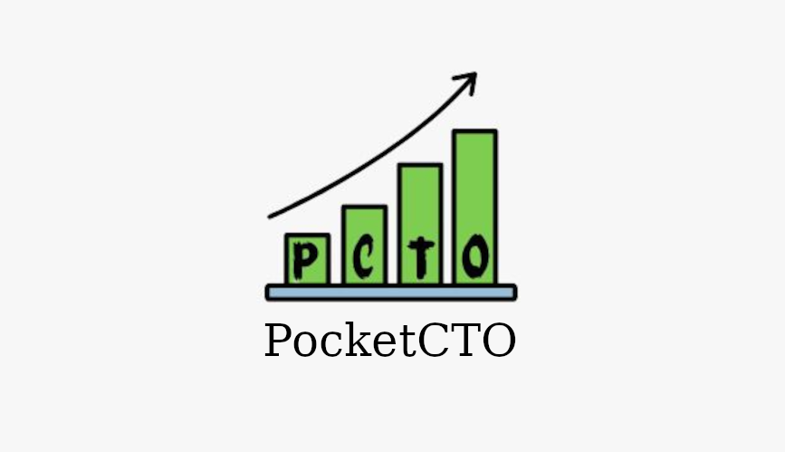

# PocketCTO 📈  

### A Handy Strategy Building Solution for Business Owners Developed by team _Alohomora_  

<!-- ALL-CONTRIBUTORS-BADGE:START - Do not remove or modify this section -->
  

<!-- ALL-CONTRIBUTORS-BADGE:END -->  

<!--

-->  

## Quick Overview 💨  
> * Created within 24hrs. during [Execute 2.0](https://executehack.in/)  
> * Brillient use of NLP, REST API, ReactJS and Django altogather  
> * A colaborative work of 5 members of _Alohomora_  

## Scope 🧩  
In this era of cutting-edge technologies, most of the startups / business models fail due to a **lack** of proper market research.  It has been really a big chellenges for brands to correctly address the demanads of society and come up with the most suitable solutions or products. Due to dynamic voletile nature of the market, existing research methodologies may not fit well into every scenario.  

**PocketCTO** aims to resolve the same problem by bring in a core data analytics, classification and NLP centered solution to help business owners and CTOs in building outstanding branding strategy and growing their revanue. 

## What's crazy about PCTO? 🤯  
The **PocketCTO** brings in a combo of handy market researcher and risk analyzor packed with ultimate user friendly UI developed with `Django` & `ReactJS` and powdered by Machine Learning methors. It performs a real time scope analysis of the proposed idea & filters the highly impactful ones. It also aims to build the strategy to execute the plans at earliest and come-up with the best possible solution for the same. 

While focusing on several dynamic aspects of growth in business and revenue making, the _PocketCTO_ does not ignore the security of involved data & results generated during the analysis. It is powered by [SecureAuth](https://github.com/ravi-prakash1907/SecureAuth-SA) for such a high-end security.

### Key Features ✨
> * User Friendly UI  
> * Market Research and Consultancy
> * Good and Fast Revenue Generation
> * Team Management & Strategy Building

---  

<!--  
## Team  
1. Aaqib Shaikh  
2. Shivam  
3. Abhijit  
4. [Ravi Prakash](https://ravi-prakash1907.gitlab.io/)  
5. Suchendra  
-->  