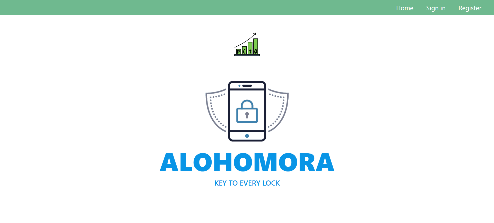

# PocketCTO  

PCTO comes with a clean and clear user inerface that is developed using `ReactJS` and powred by `Django` for backend connectivity.  

_This branch holds the source code of UI only._  